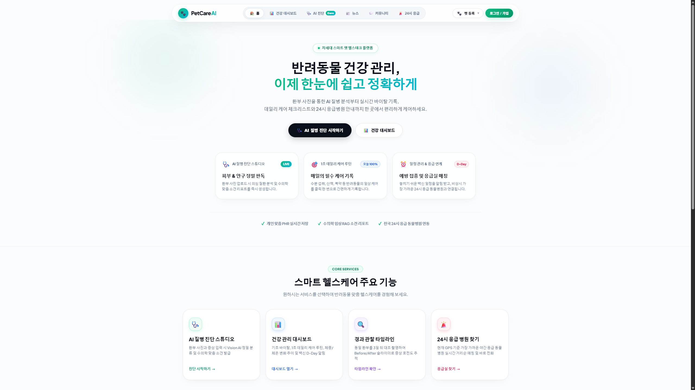
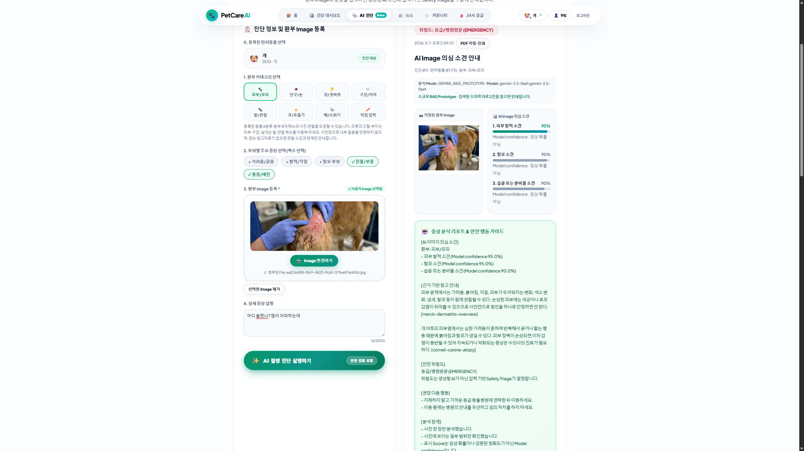
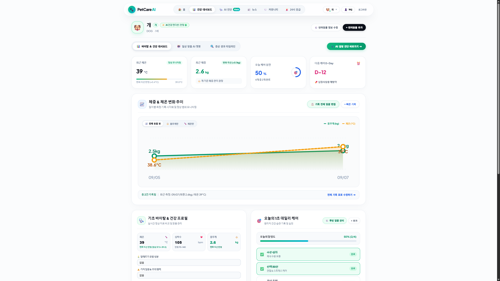
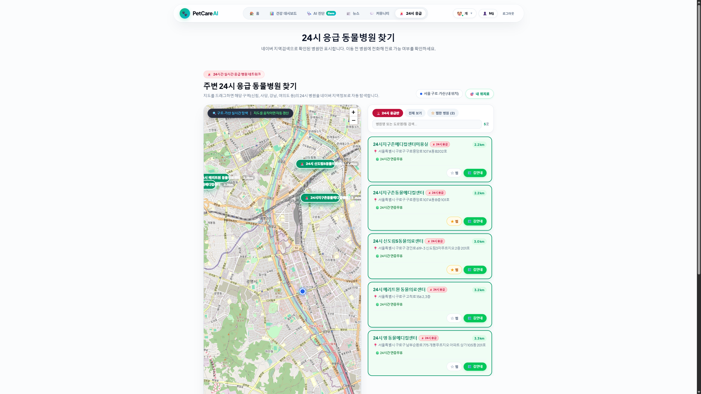
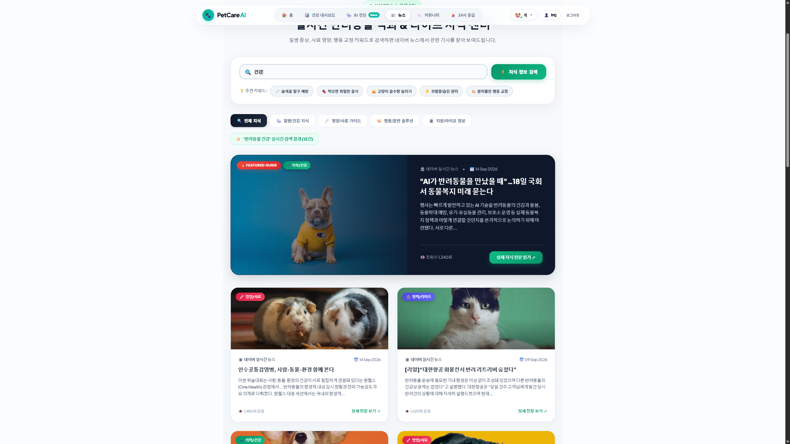

# PetCare AI

반려동물의 건강 기록과 환부 사진 기반 AI 관찰, 경과 관리, 응급 동물병원 탐색을 한곳에서 연결하는 풀스택 반려동물 헬스케어 프로젝트

- 팀 프로젝트 · 3인
- 개발 기간: 2026.08.12 ~ 2026.09.09
- React Web + Spring Boot API + FastAPI AI Service



## 화면

**AI 관찰·건강 관리** — 환부 사진과 증상 입력 기반 AI 분석 · 반려동물 건강 대시보드

<p align="center">
  <a href="docs/images/readme/02-ai-diagnosis.png"></a>
  <a href="docs/images/readme/03-health-dashboard.png"></a>
</p>

**건강 정보·응급 지원** — 주변 24시 동물병원 탐색 · 반려동물 건강 뉴스

<p align="center">
  <a href="docs/images/readme/04-emergency-hospital.png"></a>
  <a href="docs/images/readme/05-pet-news.png"></a>
</p>

> 클릭하면 원본 화면을 볼 수 있습니다. 화면의 반려동물 정보와 분석 결과는 시연용 데이터입니다.

## 핵심 — 사진 입력부터 경과 관리까지

```text
반려동물 선택·환부 사진·관찰 증상 입력
    → Spring Boot 인증·이미지 검증·중복 요청 방지
    → FastAPI 이미지 분석 Contract 호출
    → 선택적으로 Gemini Multimodal + 수의학 자료 검색
    → 안전 등급·관찰 소견·근거 자료를 구조화해 반환
    → 진단 이력 저장·Before/After 경과 비교·응급 병원 연결
```

PetCare AI의 분석 결과는 수의사의 진료나 확정 진단을 대신하지 않습니다. 사진에서 확인 가능한 외형 소견과 입력 정보를 바탕으로 보호자의 다음 행동을 돕고, 응급 징후가 있으면 병원 확인을 우선하도록 안내합니다.

## 주요 기능

| 기능 | 내용 |
| --- | --- |
| 회원·인증 | 이메일 로그인, JWT Access/Refresh Token, Google·Kakao·Naver OAuth2 연동 기반 |
| 반려동물 관리 | 반려동물 등록·조회·수정·삭제와 대표 반려동물 선택 |
| AI 이미지 분석 | 동물·환부·증상·사진을 입력하고 구조화된 관찰 결과와 한계 안내 |
| 안전 분기 | 관찰·주의·응급 단계에 따라 후속 행동과 24시 병원 탐색 연결 |
| 진단 이력·타임라인 | 반려동물별 분석 이력 조회와 동일 환부 Before/After 비교 |
| 건강 대시보드·일상 케어 | 체온·심박수·체중 등 건강 기록과 일일 케어 확인 |
| 병원·뉴스·커뮤니티 | 네이버 지역검색 기반 병원 탐색, 건강 뉴스, 진단 리포트 연계 커뮤니티 |

## AI 분석 구성

- Frontend는 JPG·PNG·WEBP 이미지를 미리 확인하고 증상·환부 정보를 함께 전송합니다.
- Spring Boot는 인증, 파일 형식·크기 검증, 요청 중복 방지, 결과 저장을 담당합니다.
- FastAPI는 Image Inference Contract를 제공하며 Gemini Adapter와 로컬 수의학 자료 검색은 기본적으로 비활성화되어 있습니다.
- Gemini를 활성화하면 Multimodal 관찰과 소규모 TF-IDF 검색 Prototype을 사용합니다. 현재 별도 학습된 Custom Vision Model이나 검증된 임상 정확도를 제공하는 단계는 아닙니다.
- Provider 오류·Timeout·자료 부족은 성공 결과로 포장하지 않고 구분된 Failure Code와 한계 문구로 반환합니다.

## 기술 스택

| 구분 | 내용 |
| --- | --- |
| Frontend | React 19, JavaScript, Vite 8, Vanilla CSS |
| Backend | Java 21, Spring Boot 3.5, MyBatis, Spring Security, JWT, OAuth2 |
| AI Service | Python, FastAPI, Gemini Multimodal Adapter, TF-IDF 기반 Local RAG Prototype |
| Database | H2(Local), PostgreSQL·Supabase Migration |
| External API | Gemini API, Naver Search API(News·Local), Leaflet·OpenStreetMap |
| 협업 | GitHub |

## 팀 구성 및 담당

| 담당 | GitHub | 범위 |
| --- | --- | --- |
| 태준 | [hat8532](https://github.com/hat8532) | 회원·인증, 반려동물 관리, 건강 대시보드, 일상 케어 챗봇 |
| 진한 | [Hdev-x](https://github.com/Hdev-x) | AI 이미지 분석, 안전 분기, 진단 이력, Before/After 타임라인 |
| 지호 | [kjs844-art](https://github.com/kjs844-art) | 24시 동물병원, 건강 뉴스, 커뮤니티 |

## 폴더 구조

```text
petcare/
├── frontend/   # React 사용자 화면
├── backend/    # Spring Boot API·인증·도메인 서비스
├── ml/         # FastAPI Image Inference Contract·Gemini/RAG Prototype
├── supabase/   # PostgreSQL Migration
└── docs/       # 요구사항·API·DB 명세·발표자료·README 이미지
```

## 실행 방법

세 서비스를 각각 실행합니다. 기본 Backend는 H2 In-Memory Database를 사용하며 AI 연동은 명시적으로 활성화해야 합니다.

### 1. AI Service (:8000)

```bash
cd ml
python3 -m venv .venv
.venv/bin/python -m pip install -r requirements.txt
.venv/bin/python -m uvicorn app.main:app --host 127.0.0.1 --port 8000
```

실제 Model 없이 API·화면 흐름만 확인하려면 AI Service 실행 환경에 `PETCARE_EXPERIMENTAL_DEMO_ENABLED=true`를 설정합니다.

### 2. Backend (:8080)

```bash
cd backend
DIAGNOSIS_VISION_ENABLED=true \
DIAGNOSIS_VISION_BASE_URL=http://127.0.0.1:8000 \
./gradlew bootRun
```

AI 기능을 사용하지 않을 때는 환경변수 없이 `./gradlew bootRun`으로 실행할 수 있습니다. OAuth, Gemini, Naver API를 사용할 때는 필요한 Secret을 로컬 환경변수로만 설정합니다.

### 3. Frontend (:5173)

```bash
cd frontend
npm ci
npm run dev
```

Frontend의 `/api` 요청은 Vite Proxy를 통해 `http://localhost:8080`으로 전달됩니다.

## 문서·발표자료

- [요구사항 정의서](docs/요구사항_정의서_상세.md)
- [API 명세서](docs/API_명세서.md)
- [Database Guide](docs/DATABASE_SCHEMA_GUIDE.md)
- [AI Service Guide](ml/README.md)
- [최종 발표자료 PDF](docs/PetCare_Fixed_Presentation.pdf)
