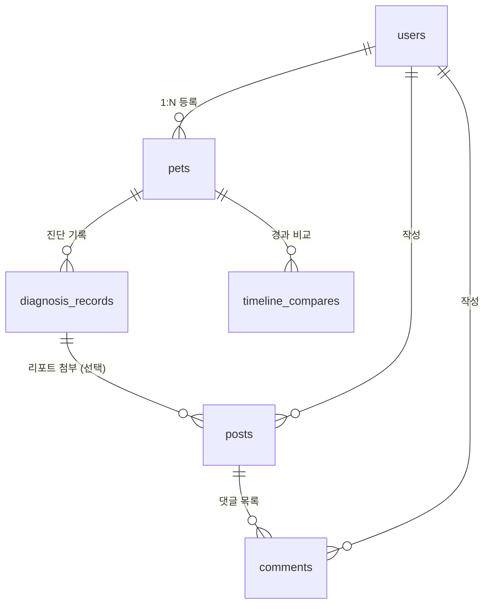

# 🐾 Generative AI & Vision AI 기반 반려동물 헬스케어 플랫폼 (PetCare)
## 요구사항 정의서 (PRD) 및 데이터베이스(DB) 명세서

---

## 1. 프로젝트 개요 (Overview)

* **프로젝트명**: PetCare (Generative AI & Vision AI 기반 반려동물 질병 진단 및 헬스케어 웹 플랫폼)
* **대상 플랫폼**: **반응형 웹 전용 (Web Application - React / JavaScript / JSX)** *(TypeScript 제외)*
* **핵심 서비스 분기 흐름 (Branching Care Flow)**:
  1. **AI 진단 실시** ➔ AI가 위험도 레벨(`risk_level`) 자동 평가
  2. **분기 A [관찰/주의 (OBSERVATION / CAUTION)]**: 가정 내 케어 가이드 ➔ **[경과 관찰 타임라인]** ➔ 경과 악화 시 병원 안내
  3. **분기 B [즉시 응급 (EMERGENCY)]**: 타임라인을 건너뛰고 🚨 **[주변 24시 응급 병원 찾기]** 즉시 핫링크 안내
  4. **선택적 커뮤니티**: 진단 리포트를 선택 첨부하여 다른 반려인과 소통하는 보조 소셜 공간
* **주요 타겟**: 반려동물의 건강 상태를 지속적으로 기록하고 웹에서 편리하게 관리하고자 하는 반려인

---

## 2. 서비스 요구사항 명세 (Requirements Specification)

### 2.1 [핵심] AI 질병 진단 (Vision AI + Gemini RAG LLM)
* **입력 데이터**:
  - 반려동물 선택 (프로필 연동)
  - 환부 사진 업로드 (피부, 눈, 귀, 구강 등)
  - 환부 카테고리 선택 및 부위별 증상 체크박스
  - 자유 작성 세부 증상 텍스트
* **AI 파이프라인**:
  - **Vision AI (PyTorch/YOLO/ResNet)**: 환부 이미지 분석 ➔ 의심 질환 Top 3 및 확률(%) 산출
  - **Gemini RAG LLM**: 입력된 텍스트 증상 + 수의학 백과 Vector DB 연동 ➔ 맞춤형 케어 가이드 리포트 자동 생성
* **결과 출력**:
  - 의심 질환 Top 3 (확률%), 위험도 등급 (`OBSERVATION` / `CAUTION` / `EMERGENCY`), 가정 내 조치 가이드, 넥카라/소독 여부 제안

### 2.2 [추가기능 A] 증상 변화 추이 타임라인 & 이미지 비교
* **Before / After 슬라이더 UI**: 동일 환부의 과거 진단 사진과 현재 사진을 한 화면에서 좌우 슬라이딩으로 시각적 비교
* **AI 경과 추이 소견**: 이전 진단 데이터와 현재 데이터를 Gemini AI가 비교 분석하여 호전/유지/악화 판단 및 추가 소견 제공

### 2.3 [추가기능 B] 실시간 펫 헬스 뉴스 (스케줄러)
* **네이버 뉴스 API 연동**: 반려동물 건강, 질병, 사료 리콜 뉴스 수집
* **백엔드 캐싱 스케줄러**: Spring Boot `@Scheduled`로 6시간마다 뉴스 자동 수집/캐싱하여 메인 페이지 하단 카드 UI로 고속 제공

### 2.4 위치 기반 24시 응급 동물병원 지도 연동
* **지도 API (카카오/네이버 지도)**: 유저 현재 위치(위도/경도) 기반 주변 동물병원 마커 표시
* **응급 필터**: '24시 응급 병원' 필터링 및 카카오/네이버 길안내 앱/웹 링크 연동

### 2.5 커뮤니티 (진단 리포트 첨부 게시판)
* **진단 리포트 연동 작성**: 게시글 작성 시 자신의 AI 진단 리포트를 선택 첨부 가능
* **반려인 정보 공유**: 비슷 한 증상을 겪은 다른 반려인들과 질문 및 노하우 댓글 소통

### 2.6 회원가입 & 반려동물 프로필 (온보딩)
* **최소 이메일/비밀번호 회원가입** 및 소셜 로그인 연동
* **1:N 반려동물 등록**: 회원 1명당 다수의 반려동물(강아지, 고양이 등) 프로필 등록 및 수정 지원

---

## 3. 기술 아키텍처 (Architecture)

```mermaid
graph TD
    Client[Web / Mobile Client] -->|REST API| SpringBoot[Spring Boot Backend :8080]
    SpringBoot -->|JPA / Hibernate| DB[(Supabase PostgreSQL)]
    SpringBoot -->|HTTP Async| FastAPI[Python FastAPI AI Server :8000]
    SpringBoot -->|@Scheduled 6h| NaverAPI[Naver News API]
    Client -->|JS SDK| KakaoMap[Kakao / Naver Map API]

    FastAPI -->|OpenCV/PyTorch| VisionAI[Vision AI Disease Classifier]
    FastAPI -->|Vector DB + Prompt| Gemini[Google Gemini 1.5/2.0 API]
```

---

## 4. 데이터베이스 정의서 (Database Schema Specification)

### 4.1 ER-Diagram (개념 모델)



---

### 4.2 테이블 상세 명세 (DDL & Columns)

#### 1) `users` (회원 테이블)
| 컬럼명 | 타입 | 제약조건 | 설명 |
| :--- | :--- | :--- | :--- |
| `id` | BIGINT | PK, AUTO_INCREMENT | 회원 고유 식별자 |
| `email` | VARCHAR(100) | UNIQUE, NOT NULL | 이메일 아이디 |
| `password` | VARCHAR(255) | NOT NULL | 암호화된 비밀번호 |
| `nickname` | VARCHAR(50) | NOT NULL | 닉네임 |
| `profile_image_url` | TEXT | NULL | 프로필 이미지 URL |
| `provider` | VARCHAR(20) | NOT NULL | 가입 유형 (LOCAL, KAKAO, GOOGLE) |
| `created_at` | TIMESTAMP | DEFAULT CURRENT_TIMESTAMP | 가입 일시 |
| `updated_at` | TIMESTAMP | DEFAULT CURRENT_TIMESTAMP | 수정 일시 |

#### 2) `pets` (반려동물 테이블)
| 컬럼명 | 타입 | 제약조건 | 설명 |
| :--- | :--- | :--- | :--- |
| `id` | BIGINT | PK, AUTO_INCREMENT | 반려동물 고유 식별자 |
| `user_id` | BIGINT | FK (users.id), NOT NULL | 소유자 회원 ID |
| `name` | VARCHAR(50) | NOT NULL | 반려동물 이름 |
| `species` | VARCHAR(20) | NOT NULL | 종 (DOG, CAT 등) |
| `breed` | VARCHAR(50) | NULL | 품종 (예: 말티즈, 코숏) |
| `birth_date` | DATE | NULL | 생년월일 |
| `gender` | VARCHAR(20) | NULL | 성별 (MALE, FEMALE, NEUTERED) |
| `weight` | DOUBLE PRECISION | NULL | 몸무게 (kg) |
| `image_url` | TEXT | NULL | 반려동물 프로필 사진 URL |
| `created_at` | TIMESTAMP | DEFAULT CURRENT_TIMESTAMP | 등록 일시 |

#### 3) `diagnosis_records` (AI 진단 기록 테이블)
| 컬럼명 | 타입 | 제약조건 | 설명 |
| :--- | :--- | :--- | :--- |
| `id` | BIGINT | PK, AUTO_INCREMENT | 진단 기록 고유 식별자 |
| `pet_id` | BIGINT | FK (pets.id), NOT NULL | 대상 반려동물 ID |
| `affected_area` | VARCHAR(50) | NOT NULL | 환부 부위 (SKIN, EYE, EAR, MOUTH 등) |
| `symptoms_json` | TEXT | NULL | 유저 선택 증상 체크박스 리스트 (JSON) |
| `description` | TEXT | NULL | 유저 직접 작성 상세 증상 |
| `image_url` | TEXT | NOT NULL | 업로드한 환부 사진 URL |
| `vision_result_json` | TEXT | NOT NULL | Vision AI 분석 결과 (의심 질환 Top 3 & 확률%) |
| `risk_level` | VARCHAR(20) | NOT NULL | 위험도 등급 (`OBSERVATION`, `CAUTION`, `EMERGENCY`) |
| `rag_report` | TEXT | NOT NULL | Gemini LLM + 수의학 백과 RAG 케어 리포트 |
| `created_at` | TIMESTAMP | DEFAULT CURRENT_TIMESTAMP | 진단 일시 |

#### 4) `timeline_compares` (증상 경과 비교 테이블)
| 컬럼명 | 타입 | 제약조건 | 설명 |
| :--- | :--- | :--- | :--- |
| `id` | BIGINT | PK, AUTO_INCREMENT | 경과 비교 기록 식별자 |
| `pet_id` | BIGINT | FK (pets.id), NOT NULL | 대상 반려동물 ID |
| `prev_diagnosis_id` | BIGINT | FK (diagnosis_records.id), NOT NULL | 이전(Before) 진단 ID |
| `curr_diagnosis_id` | BIGINT | FK (diagnosis_records.id), NOT NULL | 최근(After) 진단 ID |
| `recovery_status` | VARCHAR(20) | NOT NULL | 경과 상태 (`IMPROVED`, `STABLE`, `WORSENED`) |
| `comparison_report` | TEXT | NOT NULL | Gemini AI 경과 비교 분석 소견 리포트 |
| `created_at` | TIMESTAMP | DEFAULT CURRENT_TIMESTAMP | 비교 일시 |

#### 5) `news_items` (실시간 펫 헬스 뉴스 테이블)
| 컬럼명 | 타입 | 제약조건 | 설명 |
| :--- | :--- | :--- | :--- |
| `id` | BIGINT | PK, AUTO_INCREMENT | 뉴스 식별자 |
| `title` | VARCHAR(255) | NOT NULL | 기사 제목 |
| `origin_link` | TEXT | UNIQUE, NOT NULL | 기사 원문 URL |
| `description` | TEXT | NULL | 기사 요약본 |
| `pub_date` | TIMESTAMP | NULL | 기사 작성일 |
| `created_at` | TIMESTAMP | DEFAULT CURRENT_TIMESTAMP | 스케줄러 캐싱 수집 일시 |

#### 6) `hospitals` (24시 응급 동물병원 테이블)
| 컬럼명 | 타입 | 제약조건 | 설명 |
| :--- | :--- | :--- | :--- |
| `id` | BIGINT | PK, AUTO_INCREMENT | 병원 식별자 |
| `name` | VARCHAR(100) | NOT NULL | 병원 이름 |
| `address` | VARCHAR(255) | NOT NULL | 주소 |
| `phone` | VARCHAR(30) | NULL | 전화번호 |
| `latitude` | DOUBLE PRECISION | NOT NULL | 위도 |
| `longitude` | DOUBLE PRECISION | NOT NULL | 경도 |
| `is_emergency_24h` | BOOLEAN | DEFAULT TRUE | 24시 응급 여부 |

#### 7) `posts` (커뮤니티 게시글 테이블)
| 컬럼명 | 타입 | 제약조건 | 설명 |
| :--- | :--- | :--- | :--- |
| `id` | BIGINT | PK, AUTO_INCREMENT | 게시글 식별자 |
| `user_id` | BIGINT | FK (users.id), NOT NULL | 작성자 회원 ID |
| `pet_id` | BIGINT | FK (pets.id), NULL | 관련 반려동물 ID (선택) |
| `diagnosis_record_id` | BIGINT | FK (diagnosis_records.id), NULL | 첨부된 AI 진단 리포트 ID (선택) |
| `title` | VARCHAR(150) | NOT NULL | 게시글 제목 |
| `content` | TEXT | NOT NULL | 게시글 본문 |
| `view_count` | INT | DEFAULT 0 | 조회수 |
| `created_at` | TIMESTAMP | DEFAULT CURRENT_TIMESTAMP | 작성 일시 |
| `updated_at` | TIMESTAMP | DEFAULT CURRENT_TIMESTAMP | 수정 일시 |

#### 8) `comments` (커뮤니티 댓글 테이블)
| 컬럼명 | 타입 | 제약조건 | 설명 |
| :--- | :--- | :--- | :--- |
| `id` | BIGINT | PK, AUTO_INCREMENT | 댓글 식별자 |
| `post_id` | BIGINT | FK (posts.id), NOT NULL | 대상 게시글 ID |
| `user_id` | BIGINT | FK (users.id), NOT NULL | 작성자 회원 ID |
| `content` | TEXT | NOT NULL | 댓글 내용 |
| `created_at` | TIMESTAMP | DEFAULT CURRENT_TIMESTAMP | 작성 일시 |
